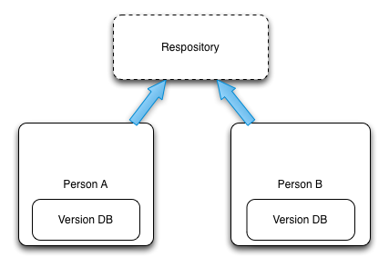
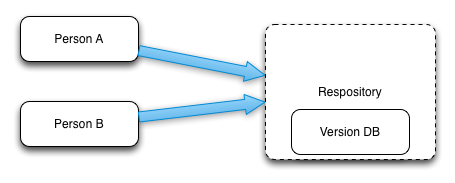
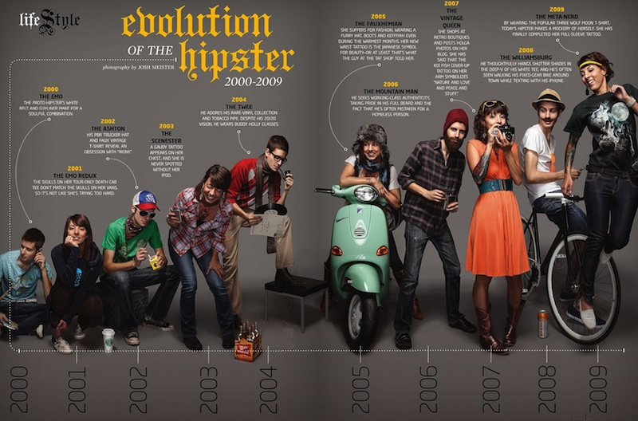
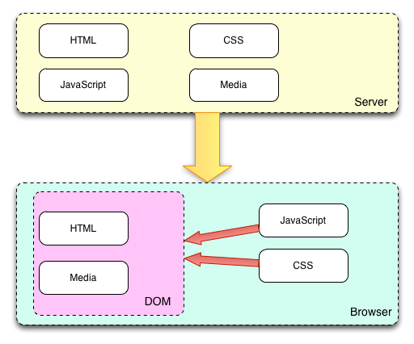

# Becoming an Open Source JavaScript Hipster

---

## Our Presenters

## David Luecke

* GitHub: [daffl.github.com](http://daffl.github.com), Twitter: [@daffl](http://twitter.com/daffl)

## Eric Kryski

* GitHub: [ekryski.github.com](http://ekryski.github.com), Twitter: [@ekryski](http://twitter.com/ekryski)

## Mike Warren

* GitHub: [github.com/meejah](https://github.com/meejah), Twitter: [@meejah](http://twitter.com/meejah)

---

## Our Sponsors

## Assembly Co-working Space

## Village Brewery

---

## Give a Mile

* Helping grant end of life wishes
* Crowd funding by cash or points donation

---

## Basic Web Stack

---

## The Essential Hipster Mustache

* As promised, awesome hipster staches

---

## A browser

---

## Yes really, just a browser

Online JS tools

- [JSFiddle](http://jsfiddle.net/)
- [JSBin](http://jsbin.com/)
- [Cloud9 IDE](https://c9.io)

Developer tools

- Google Chrome Dev Tools
- Firebug
- Safari Developer Tools
- Internet Explorer Developer Toolbar

---

## Developing...

Text editors

* [Sublime Text 2](http://www.sublimetext.com)
* [TextMate](http://macromates.com)
* [Notepad++](http://notepad-plus-plus.org/)
* [VIM](http://www.vim.org/), [EMacs](http://www.gnu.org/software/emacs/)

IDEs

* [Webstorm](http://www.jetbrains.com/webstorm/) (IntelliJ)
* [Aptana](http://aptana.com/) (Eclipse)

---

## Version Control

* What?
* Why? (Even non-devs can use this)
* Distributed (Git) vs. Centralized (SVN)
* Hosted Solutions: Github, Bitbucket, Beanstock, Redmine

---

## Distributed

---

## Centralized

---

## Github FTW

Live Demo!

* Registration (new signup)
* The interface
* Creating a repo
* Forking a repo
* Cloning a repo

---

## Git for Noobs

* Github for Mac
* Github for Windows

---

## Developer Focused Git

* [Source Tree ](http://www.sourcetreeapp.com/) (slightly less noobish)
* Command line (for fast typers or neckbeards)

---

## Fixies

---

## Recap

* We have an idea!
* We have a text editor!
* We have source control!
* Ok now let's build something :-)

---

## HTML 5

* It pretty much the same as old HTML!
* Some new tags (ex. number, email, date)
* New APIs. They are just JavaScript!
* Can do some crazy stuff with these API's that we'll look at later in the year

---

## Appropriate Hipster Attire

---

## CSS

* CSS 3 is the new kid on the block
* Again some new things but it's still CSS
* Crazy things you can do like WebGL shaders in CSS, animations, drop shadows, a lot of stuff you can do in Photoshop!

---

## Twitter Bootstrap

* A Beautiful CSS Framework
* Brought easy and pretty UI to developers
* Support all modern browsers and IE 7+
* [Wrapbootstrap](https://wrapbootstrap.com/)
* [Bootswatch](http://bootswatch.com/)
* [Bootswatcher](http://bootswatcher.com/)

---

## JavaScript

* It is the programming language of the web (and our favourite)
* This makes your app work and your website fancy!
*

---

## JavaScript in the Browser

---

## The DOM

* It isn't as ominous as it sounds
* The internal representation of your HTML

---

## jQuery

* Simplifies DOM manipulation, traversal and event handling
* AJAX support
* Effects
* UI elements with [jQuery UI](http://jqueryui.com) (~200Kb)
* Eliminates cross browser differences
* Plugin mechanism
* Fully open source (MIT licensed)
* ~ 32Kb in size

---

## jQuery - Example

__jQuery__

	!javascript
	$(document).ready(function() {
		$('button').click(function() {
			var name = $('[name="your-name"]').val();
			$('#mydiv').html('Hi ' + name);
		});
	});

__HTML Markup__

	!html
	<input type="text" name="your-name" />
	<button>Say Hi</button>
	

---

## Contributing to Open Source
* Anyone can do it
* You can easily report issues on Github
* It can be as minor as fixing typos

---

## Next Month

* Templates
* Build tools ([GruntJS](http://gruntjs.com))
* More jQuery!

